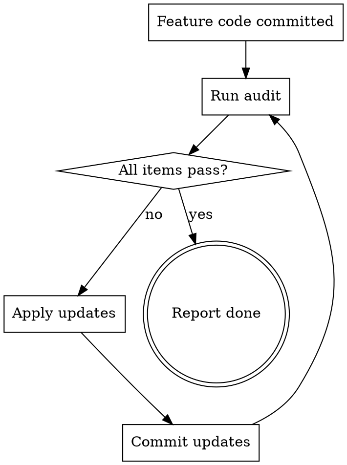

# Post-Feature Audit & Update

After shipping feature code, audit all related areas and apply updates. Never declare a feature "done" until this checklist passes.

## Trigger

Run this after the last code commit for a feature, before reporting completion to the user.

## Checklist



For each item, check if the feature touched anything that makes it stale. Skip items that don't apply.

### 1. Steering Docs (`docs/steering/`)

| Check | Action |
|-------|--------|
| Feature modifies an existing system (economy, confession, XP, etc.)? | Update the relevant `docs/steering/{system}.md` |
| Feature creates a new system? | Create `docs/steering/{new-system}.md` |
| Feature changes business rules, cooldowns, costs, limits? | Update the numbers in the steering doc |

### 2. CLAUDE.md

| Check | Action |
|-------|--------|
| New model/service/command added? | Update Architecture section |
| New config/env var? | Update Environment section |
| New convention or pattern introduced? | Update relevant Convention section |

### 3. Landing Site — Guides (`landing/src/content/guides/{en,vi}/`)

| Check | Action |
|-------|--------|
| Feature enhances an existing guide topic? | Update the EN + VI guide |
| Feature is big enough for its own guide? | Create new EN + VI guide + register in `guides.ts` |

### 4. Landing Site — Commands (`landing/src/content/commands/{en,vi}/`)

| Check | Action |
|-------|--------|
| New slash command added? | Create EN + VI command page |
| Existing command gained new subcommands/options? | Update existing EN + VI page |
| New command not in `commands.ts`? | Register in `landing/src/data/commands.ts` |

### 5. Help Categories (`src/util/help/commandCategories.ts`)

| Check | Action |
|-------|--------|
| New slash command not in the category map? | Add it to the appropriate category |

### 6. i18n (`src/locales/*.json`)

| Check | Action |
|-------|--------|
| New user-facing strings added? | Verify all 15 locale files have the keys |
| Command description localization? | Add `cmd.{command}.desc` key via `descriptionLocales()` |

### 7. Changelog (`CHANGELOG.md`)

| Check | Action |
|-------|--------|
| Any new feature, fix, or change? | Add entry under `## [Unreleased]` |

### 8. Premium Config (if applicable)

| Check | Action |
|-------|--------|
| Feature has premium-gated behavior? | Verify `premium.config.ts` has the fields |
| Premium guide lists this benefit? | Update `landing/src/content/guides/{en,vi}/premium.md` |

## How to Audit

Run this grep to find what changed:

```bash
git diff --name-only HEAD~N  # N = number of feature commits
```

Cross-reference changed files against the checklist above. For each category, check if any updates are needed.

## Output

Report to the user:
- Items that were already up-to-date (skip)
- Items that need updates (list specifically what)
- Updates applied (with commit)
